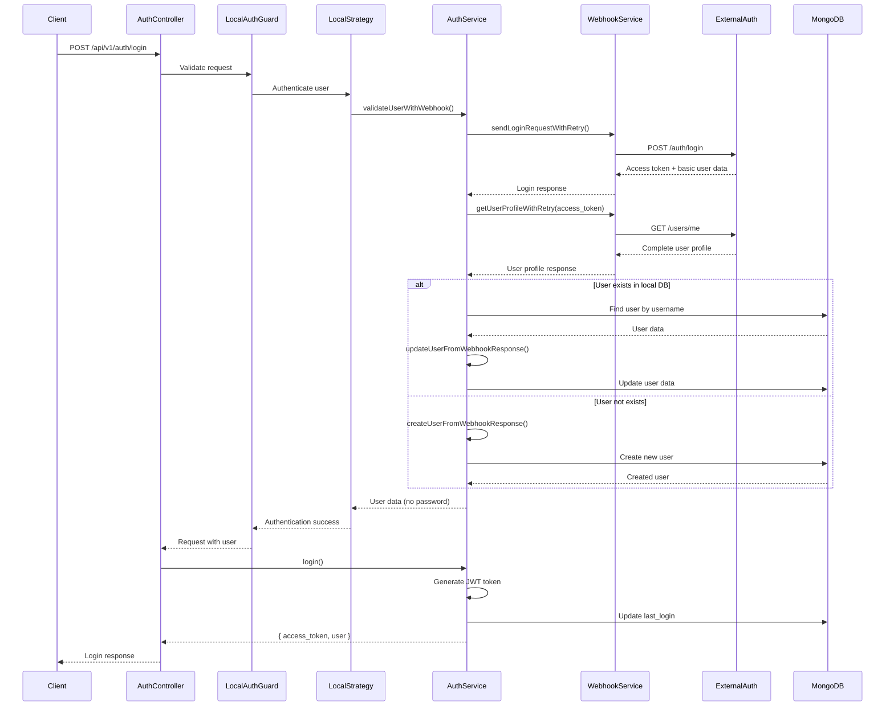
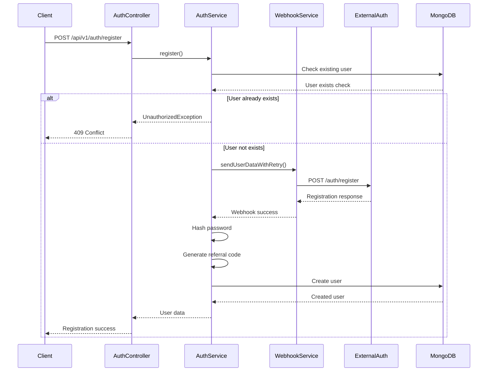
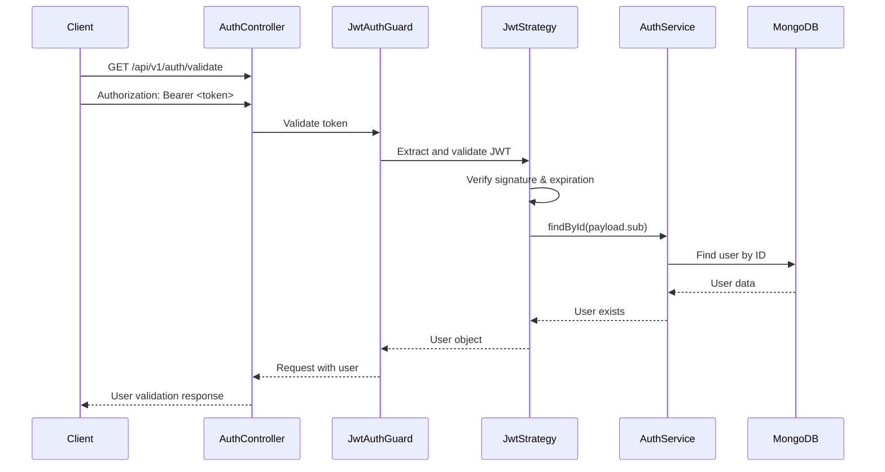

# Auth Module - API Gateway

## Tổng quan

Module Auth trong API Gateway cung cấp hệ thống xác thực và phân quyền cho toàn bộ ứng dụng. Module này tích hợp với hệ thống webhook bên ngoài để đồng bộ hóa dữ liệu người dùng và cung cấp các tính năng đăng nhập, đăng ký, và quản lý phiên làm việc.

## Kiến trúc Module

### Cấu trúc thư mục
```
src/auth/
├── auth.controller.ts          # Controller xử lý HTTP requests
├── auth.service.ts             # Service chứa business logic
├── auth.module.ts              # Module configuration
├── auth.service.spec.ts        # Unit tests
├── external-user.service.ts    # Service tích hợp với external API
├── decorators/
│   └── roles.decorator.ts      # Decorator cho role-based access
├── dto/
│   ├── auth-response.dto.ts    # Response DTO cho auth endpoints
│   ├── login.dto.ts           # DTO cho login request
│   └── register.dto.ts        # DTO cho register request
├── guards/
│   ├── jwt-auth.guard.ts      # JWT authentication guard
│   ├── local-auth.guard.ts    # Local authentication guard
│   └── roles.guard.ts         # Role-based authorization guard
└── strategies/
    ├── jwt.strategy.ts        # JWT passport strategy
    └── local.strategy.ts      # Local passport strategy
```

## Workflow Implementation

### 1. Đăng nhập (Login Workflow)

#### 1.1 Luồng xử lý chính


#### 1.2 Chi tiết implementation

**Bước 1: Request Validation**
- Client gửi POST request đến `/api/v1/auth/login`
- Dữ liệu được validate qua `LoginDto` (email/username + password)
- `LocalAuthGuard` được áp dụng để bảo vệ endpoint

**Bước 2: Authentication Strategy**
- `LocalStrategy` xử lý authentication
- Gọi `AuthService.validateUserWithWebhook()` với identifier (email hoặc username)

**Bước 3: Webhook Integration**
- Gửi request đến external auth service: `https://auth.luck8event.com/api/v1/auth/login`
- Sử dụng retry mechanism (tối đa 3 lần) nếu request thất bại
- Nhận response chứa access_token từ external service
- Gọi tiếp endpoint `/users/me` với access_token để lấy thông tin user đầy đủ

**Bước 4: Local Database Sync**
- Kiểm tra user có tồn tại trong MongoDB local không (tìm bằng username)
- Nếu chưa có: tự động tạo user mới từ `/users/me` response
- Nếu đã có: cập nhật thông tin user từ `/users/me` response (points, phone, address, etc.)

**Bước 5: Token Generation**
- Tạo JWT token với payload: `{ email, sub: user._id, role, external_id }`
- Cập nhật `last_login` timestamp
- Trả về `access_token` và thông tin user (không bao gồm password)

#### 1.3 Fallback Mechanism
Nếu webhook thất bại, hệ thống sẽ fallback về local validation:
- Tìm user bằng email hoặc username trong local database
- Validate password bằng bcrypt
- Chỉ trả về user data nếu validation thành công

### 2. Đăng ký (Registration Workflow)

#### 2.1 Luồng xử lý chính


#### 2.2 Chi tiết implementation

**Bước 1: Input Validation**
- Validate dữ liệu qua `RegisterDto`
- Kiểm tra email format, phone number format (VN)
- Validate password minimum length (6 characters)

**Bước 2: Duplicate Check**
- Kiểm tra email và username đã tồn tại trong local database
- Nếu tồn tại: trả về 409 Conflict error

**Bước 3: External Registration**
- Gửi user data đến external auth service
- Sử dụng retry mechanism (tối đa 3 lần)
- Chờ response từ external service trước khi tạo user local

**Bước 4: Local User Creation**
- Hash password bằng bcrypt (salt rounds: 10)
- Generate unique referral code (8 ký tự alphanumeric)
- Tạo user trong MongoDB với dữ liệu từ webhook response
- Set default values: `points: 0`, `sms_verified: false`, `role: 'user'`, `is_active: true`

**Bước 5: Response**
- Trả về user data (không bao gồm password)
- Bao gồm tất cả thông tin: id, username, email, phone, address, points, referral_code, etc.

### 3. Token Validation Workflow

#### 3.1 Luồng xử lý


#### 3.2 Chi tiết implementation

**Bước 1: Token Extraction**
- `JwtStrategy` extract token từ `Authorization: Bearer <token>` header
- Verify JWT signature và expiration time

**Bước 2: User Lookup**
- Sử dụng `payload.sub` (user ID) để tìm user trong database
- Nếu user không tồn tại: trả về null (unauthorized)

**Bước 3: Response**
- Trả về thông tin user: `{ id, email, name, role }`
- Endpoint này được sử dụng bởi các microservice khác để validate token

### 4. Role-Based Authorization

#### 4.1 Implementation
- Sử dụng `@Roles()` decorator để định nghĩa required roles
- `RolesGuard` kiểm tra user role có match với required roles không
- Hỗ trợ multiple roles: `@Roles(UserRole.ADMIN, UserRole.STAFF)`

#### 4.2 User Roles
```typescript
enum UserRole {
  ADMIN = 'admin',    // Quản trị viên
  USER = 'user',      // Người dùng thường
  CASTER = 'caster',  // Caster/Streamer
  STAFF = 'staff'     // Nhân viên
}
```

## Dependencies

### External Services
- **Auth Webhook**: `https://auth.luck8event.com/api/v1`
  - Endpoint: `/auth/login` (POST)
  - Endpoint: `/auth/register` (POST)
  - Timeout: 10 seconds
  - Retry: 3 lần

### Internal Dependencies
- **MongoDB**: Lưu trữ user data local
- **JWT**: Token-based authentication
- **bcryptjs**: Password hashing
- **WebhookModule**: Xử lý external API calls

## Configuration

### Environment Variables
```env
# JWT Configuration
JWT_SECRET=your-jwt-secret-key
JWT_EXPIRES_IN=7d

# Auth Webhook
AUTH_WEBHOOK_URL=https://auth.luck8event.com/api/v1

# MongoDB
MONGODB_URI=mongodb://localhost:27017/vaoluoi

# External User API (optional)
EXTERNAL_USER_API_URL=https://external-api.com
EXTERNAL_USER_API_KEY=your-api-key
```

## Error Handling

### Common Error Scenarios
1. **Invalid Credentials**: 401 Unauthorized
2. **User Already Exists**: 409 Conflict
3. **Webhook Timeout**: 408 Request Timeout
4. **Webhook Error**: 500 Internal Server Error
5. **Invalid Token**: 401 Unauthorized
6. **Insufficient Permissions**: 403 Forbidden

### Fallback Strategies
- Webhook failure → Local validation
- External service down → Graceful degradation
- Database connection issues → Proper error responses

## Security Considerations

### Password Security
- Passwords được hash bằng bcrypt với salt rounds = 10
- Password không bao giờ được trả về trong response
- Password validation được thực hiện ở cả local và external service

### Token Security
- JWT tokens có expiration time (default: 7 days)
- Tokens được signed bằng secret key
- Token validation được thực hiện ở mọi protected endpoint

### Data Privacy
- Sensitive data (password, tokens) không được log
- User data được sanitize trước khi trả về client
- Proper error messages không expose internal system details

## Testing

### Unit Tests
- `auth.service.spec.ts`: Test các method chính của AuthService
- Mock external dependencies (MongoDB, JWT, Webhook)
- Test các edge cases và error scenarios

### Integration Tests
- Test full authentication flow
- Test webhook integration
- Test database operations

## Monitoring & Logging

### Logging Strategy
- Structured logging với Winston
- Log levels: ERROR, WARN, INFO, DEBUG
- Sensitive data được mask trong logs

### Key Metrics
- Login success/failure rates
- Registration success rates
- Webhook response times
- Token validation frequency
- Error rates by endpoint

## Performance Considerations

### Optimization Strategies
- Connection pooling cho MongoDB
- JWT token caching
- Webhook request batching (future enhancement)
- Database indexing trên email và username

### Scalability
- Stateless JWT tokens
- Horizontal scaling support
- External service integration
- Microservice architecture ready

## Future Enhancements

### Planned Features
1. **Refresh Token**: Implement refresh token mechanism
2. **OAuth Integration**: Support Google, Facebook login
3. **Multi-factor Authentication**: SMS/Email OTP
4. **Session Management**: Active session tracking
5. **Password Reset**: Email-based password reset
6. **Account Lockout**: Brute force protection
7. **Audit Logging**: User action tracking

### Technical Improvements
1. **Rate Limiting**: API rate limiting
2. **Caching**: Redis integration for session caching
3. **Metrics**: Prometheus metrics integration
4. **Health Checks**: Service health monitoring
5. **Circuit Breaker**: External service resilience

