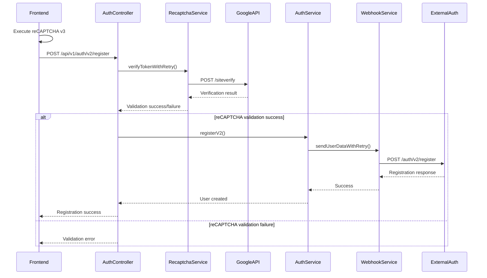

# reCAPTCHA v3 Integration - Auth Module

## Tổng quan

Module Auth đã được tích hợp reCAPTCHA v3 để tăng cường bảo mật cho quá trình đăng ký người dùng. reCAPTCHA v3 hoạt động trong nền và cung cấp điểm số từ 0.0 đến 1.0 để đánh giá mức độ đáng tin cậy của người dùng.

## Kiến trúc Integration

### Workflow reCAPTCHA v3



## Implementation Details

### 1. RecaptchaService

**File:** `src/auth/recaptcha.service.ts`

**Chức năng chính:**
- Xác minh reCAPTCHA v3 token với Google API
- Kiểm tra điểm số và action
- Retry mechanism với exponential backoff
- Error handling và logging

**Key Methods:**
```typescript
// Xác minh token với Google
async verifyToken(token: string, remoteIp?: string, expectedAction: string = 'register')

// Xác minh với retry mechanism
async verifyTokenWithRetry(token: string, remoteIp?: string, expectedAction: string = 'register', maxRetries: number = 3)

// Kiểm tra cấu hình
isConfigured(): boolean
```

**Validation Rules:**
- Token không được null/empty
- Action phải khớp với expected action
- Score phải >= 0.5 (có thể cấu hình)
- Response từ Google phải success = true

### 2. RegisterV2Dto

**File:** `src/auth/dto/register-v2.dto.ts`

**Fields:**
```typescript
{
  username: string;           // Required
  display_name?: string;      // Optional
  email: string;             // Required, email format
  password: string;           // Required, min 6 chars
  phone_number?: string;      // Optional, VN format
  address?: string;          // Optional
  referral_code?: string;    // Optional (mapped from invited_by)
  recaptchaToken: string;    // Required for v2 endpoint
}
```

### 3. AuthService.registerV2()

**Workflow:**
1. **reCAPTCHA Validation**: Verify token với Google API
2. **Duplicate Check**: Kiểm tra email/username đã tồn tại
3. **Webhook Call**: Gửi data đến external auth service
4. **User Creation**: Tạo user trong local database
5. **Response**: Trả về user data (không bao gồm password)

### 4. AuthController.registerV2()

**Endpoint:** `POST /api/v1/auth/v2/register`

**Request Body:**
```json
{
  "username": "jolene",
  "email": "user@example.com",
  "password": "password123",
  "phone_number": "+84901234567",
  "address": "123 Đường ABC, Quận 1, TP.HCM",
  "referral_code": "VNLZHX0W",
  "recaptchaToken": "03AFcWeA...v3token"
}
```

**Response (201 Created):**
```json
{
  "message": "Registration successful",
  "user": {
    "id": "5a1101a4-c71e-4695-b344-457522dc92ed",
    "username": "jolene",
    "email": "user@example.com",
    "phone_number": "+84901234567",
    "address": "123 Đường ABC, Quận 1, TP.HCM",
    "sms_verified": false,
    "points": 0,
    "referral_code": "VNLZHX0W",
    "invited_by": "VNLZHX0W",
    "role": "user",
    "is_active": true,
    "created_at": "2025-09-23T02:55:00.698Z",
    "updated_at": "2025-09-23T02:55:00.698Z"
  }
}
```

## Configuration

### Environment Variables

```env
# reCAPTCHA Configuration
RECAPTCHA_SECRET_KEY=your-secret-key-here
RECAPTCHA_SITE_KEY=your-site-key-here
RECAPTCHA_MIN_SCORE=0.5
```

### AppConfigService

**New Properties:**
```typescript
get recaptchaSecretKey(): string
get recaptchaSiteKey(): string
get recaptchaMinScore(): number
```

## Frontend Integration

### 1. HTML Setup

```html
<head>
  <script src="https://www.google.com/recaptcha/api.js?render=YOUR_SITE_KEY"></script>
</head>
```

### 2. JavaScript Implementation

```javascript
// Execute reCAPTCHA v3
grecaptcha.ready(function() {
  grecaptcha.execute('YOUR_SITE_KEY', {action: 'register'}).then(function(token) {
    // Thêm token vào form
    document.getElementById('recaptchaToken').value = token;
    
    // Gửi form đến backend
    fetch('/api/v1/auth/v2/register', {
      method: 'POST',
      headers: {
        'Content-Type': 'application/json',
      },
      body: JSON.stringify({
        username: 'jolene',
        email: 'user@example.com',
        password: 'password123',
        recaptchaToken: token
      })
    })
    .then(response => response.json())
    .then(data => {
      if (data.message === 'Registration successful') {
        // Đăng ký thành công
      } else {
        // Xử lý lỗi
      }
    });
  });
});
```

### 3. React Integration

```jsx
import { useEffect, useState } from 'react';

const RegisterForm = () => {
  const [recaptchaToken, setRecaptchaToken] = useState('');

  useEffect(() => {
    const executeRecaptcha = () => {
      if (window.grecaptcha) {
        window.grecaptcha.ready(() => {
          window.grecaptcha.execute('YOUR_SITE_KEY', { action: 'register' })
            .then((token) => {
              setRecaptchaToken(token);
            });
        });
      }
    };

    executeRecaptcha();
  }, []);

  const handleSubmit = async (formData) => {
    const response = await fetch('/api/v1/auth/v2/register', {
      method: 'POST',
      headers: {
        'Content-Type': 'application/json',
      },
      body: JSON.stringify({
        ...formData,
        recaptchaToken
      })
    });

    const result = await response.json();
    return result;
  };

  return (
    <form onSubmit={handleSubmit}>
      {/* Form fields */}
      <button type="submit" disabled={!recaptchaToken}>
        Đăng ký
      </button>
    </form>
  );
};
```

## Error Handling

### reCAPTCHA Validation Errors

| Error Code | Description | Solution |
|------------|-------------|----------|
| 400 | Token validation failed | Kiểm tra token và thử lại |
| 400 | Action mismatch | Đảm bảo action = 'register' |
| 400 | Score too low | Tăng điểm số hoặc kiểm tra user behavior |
| 503 | Google API unavailable | Retry sau vài phút |
| 408 | Request timeout | Kiểm tra network connection |

### Common Error Responses

```json
{
  "success": false,
  "message": "reCAPTCHA validation failed",
  "errorCodes": ["invalid-input-response"]
}
```

```json
{
  "success": false,
  "message": "reCAPTCHA score too low",
  "score": 0.3,
  "threshold": 0.5
}
```

## Security Considerations

### 1. Token Validation
- Token chỉ có hiệu lực trong 2 phút
- Mỗi token chỉ sử dụng được 1 lần
- Token phải được generate từ domain đã đăng ký

### 2. Score Threshold
- **0.9 - 1.0**: Very likely human
- **0.7 - 0.9**: Likely human
- **0.5 - 0.7**: Neutral
- **0.1 - 0.5**: Likely bot
- **0.0 - 0.1**: Very likely bot

### 3. Best Practices
- Sử dụng HTTPS cho tất cả requests
- Validate token ở cả frontend và backend
- Log các attempts với score thấp
- Monitor và điều chỉnh threshold theo thời gian

## Testing

### 1. Test Keys

**Site Key (Frontend):**
```
6LeIxAcTAAAAAJcZVRqyHh71UMIEGNQ_MXjiZKhI
```

**Secret Key (Backend):**
```
6LeIxAcTAAAAAGG-vFI1TnRWxMZNFuojJ4WifJ5
```

### 2. Test Scenarios

```bash
# Test với valid token
curl -X POST http://localhost:3000/api/v1/auth/v2/register \
  -H "Content-Type: application/json" \
  -d '{
    "username": "testuser",
    "email": "test@example.com",
    "password": "password123",
    "recaptchaToken": "03AFcWeA...v3token"
  }'

# Test với invalid token
curl -X POST http://localhost:3000/api/v1/auth/v2/register \
  -H "Content-Type: application/json" \
  -d '{
    "username": "testuser",
    "email": "test@example.com",
    "password": "password123",
    "recaptchaToken": "invalid-token"
  }'
```

### 3. Monitoring

**Logs to Monitor:**
- reCAPTCHA verification attempts
- Score distribution
- Failed validations
- Webhook integration status

**Metrics to Track:**
- Registration success rate
- reCAPTCHA validation success rate
- Average score distribution
- Error rates by type

## Migration Guide

### From v1 to v2

1. **Update Frontend:**
   - Thêm reCAPTCHA v3 script
   - Execute reCAPTCHA trước khi submit form
   - Thêm recaptchaToken vào request body

2. **Update Backend:**
   - Sử dụng endpoint `/api/v1/auth/v2/register`
   - Cấu hình RECAPTCHA_SECRET_KEY
   - Test với test keys trước

3. **Gradual Rollout:**
   - Deploy v2 endpoint song song với v1
   - Test với một phần traffic
   - Monitor metrics và error rates
   - Switch hoàn toàn sang v2

## Troubleshooting

### Common Issues

1. **"reCAPTCHA token is required"**
   - Kiểm tra frontend có execute reCAPTCHA không
   - Đảm bảo token được gửi trong request body

2. **"reCAPTCHA verification failed"**
   - Kiểm tra SECRET_KEY có đúng không
   - Verify domain có được đăng ký không
   - Kiểm tra token có hết hạn không

3. **"Score too low"**
   - Điều chỉnh threshold trong config
   - Kiểm tra user behavior patterns
   - Monitor score distribution

### Debug Mode

```typescript
// Enable debug logging
this.logger.debug(`reCAPTCHA verification result: ${JSON.stringify(result)}`);
```

## Future Enhancements

### Planned Features
1. **Dynamic Threshold**: Điều chỉnh threshold dựa trên user behavior
2. **Multi-action Support**: Hỗ trợ nhiều action types
3. **Analytics Integration**: Tích hợp với analytics platform
4. **A/B Testing**: Test different thresholds
5. **Machine Learning**: Sử dụng ML để optimize threshold

### Performance Optimizations
1. **Token Caching**: Cache validation results
2. **Batch Validation**: Validate multiple tokens cùng lúc
3. **Async Processing**: Xử lý validation async
4. **CDN Integration**: Sử dụng CDN cho reCAPTCHA script

## Conclusion

reCAPTCHA v3 integration cung cấp một lớp bảo mật mạnh mẽ cho quá trình đăng ký người dùng. Với implementation hiện tại, hệ thống có thể:

- Validate reCAPTCHA tokens với Google API
- Xử lý lỗi và retry mechanism
- Tích hợp với existing webhook workflow
- Cung cấp logging và monitoring
- Hỗ trợ gradual migration từ v1

Việc tích hợp này giúp giảm thiểu spam và bot registrations while maintaining a smooth user experience.
